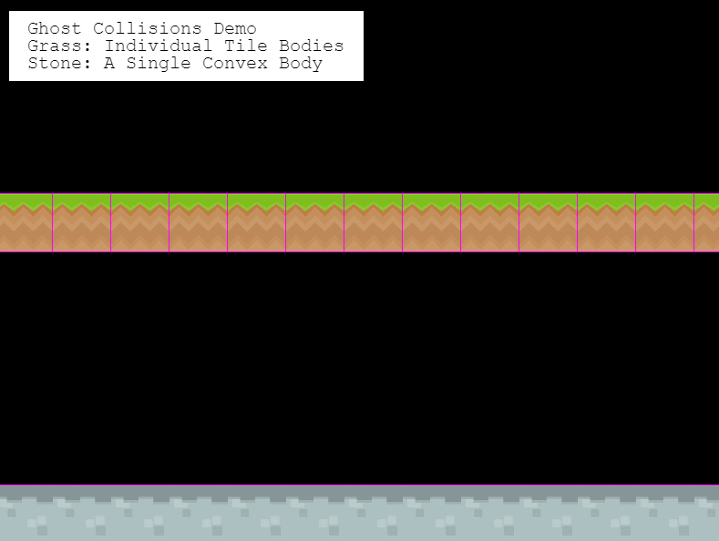
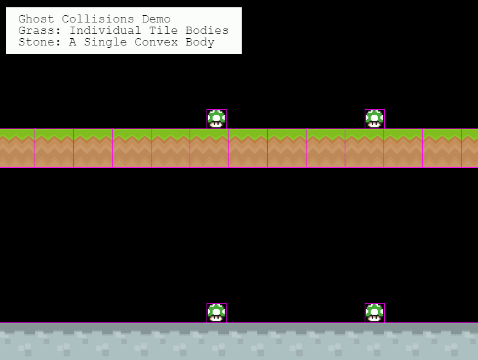

# Phaser 3 Slopes Plugin

A [Phaser 3](https://github.com/photonstorm/phaser) Plugin that smooths out MatterJS Tilemap Layer collisions.

 

# Usage

Install the plugin as a dependency of your project using [npm](https://www.npmjs.com/).

```bash
npm install hexus/phaser-slopes
```

Load the plugin into your Scene.

```js
import Slopes from 'phaser-slopes';

class GameScene extends Phaser.Scene
{
    preload() {
        this.load.scenePlugin('Slopes', Slopes);
    }
}
```

You can use Phaser to load the plugin as a script you're not using [npm](https://www.npmjs.com/) for dependency
management.

```js
class GameScene extends Phaser.Scene
{
    preload() {
        this.load.scenePlugin('Slopes', 'phaser-slopes.min.js');
    }
}
```

Any MatterJS Tilemap Layers you create within the Scene will automatically collide smoothly with other physics bodies.


